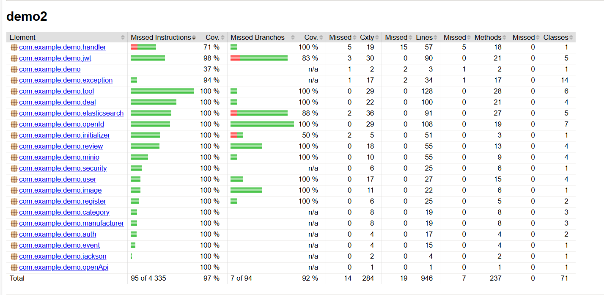

# 🛠 Tools Changer API

## Description

**Tools Changer API** is a backend service that enables users to **publish, search, rent, buy, and exchange tools**. It
simplifies tool sharing by connecting tool owners with those who need them.

### Who is it for?

This API is designed for:

- **Construction companies** – optimize equipment costs through tool sharing.
- **DIY enthusiasts & craftsmen** – rent tools instead of buying expensive equipment.
- **Local communities** – encourage tool reuse and reduce unnecessary spending.

### How it works

1. Users publish listings with tool details and images.
2. Others search for tools using full-text search and advanced filters.
3. Rental or purchase requests are sent to tool owners.
4. Owners manage requests and approve or reject them.
5. After the transaction, both parties leave reviews and ratings.

---

## Technology Stack

### Backend

- **Java 17** — main programming language
- **Spring Boot** — core framework

### Authentication & Security

- **JWT** — token-based authentication
- **Google OpenID** — authentication via Google account

### Database & Storage

- **PostgreSQL** — relational database
- **Elasticsearch** — full-text search with filtering
- **MinIO** — S3-compatible object storage for images
- **Redis** — caching frequently accessed data

### DevOps & Deployment

- **Docker + Docker Compose** — containerization and deployment
- **Nginx** — reverse proxy for image processing

### Testing

- **JUnit, Mockito** — unit testing
- **Testcontainers** — integration testing
- **Jacoco** — test coverage analysis

### Documentation & Logging

- **Swagger** — API documentation
- **Logback** — structured logging

---

## Features

### Tool Management

- **Publish Tools** – Post tools for rent, sale, or exchange with images and tool details.
- **Edit Listings** – Add or remove images, update tool details.
- **Remove Listings** – Remove tools that are no longer available.

### Search & Filtering

- **Full-Text Search** – Find tools quickly using keywords (powered by Elasticsearch).
- **Advanced Filtering** – Filter by category, manufacturer, condition, price, or availability, view all or your own tools with pagination.
- **Custom Search Analyzer** – Elasticsearch uses a custom `description_analyzer` with:
  - **Edge N-gram tokenizer** for partial word matching (e.g. "mak" → "makita").
  - **Synonym filter** that supports brand and tool name synonyms in both English and Russian.
  - **Russian stopwords removal** for better relevance in searches.

### Transactions & Requests

- **Rental & Purchase Requests** – Send requests to tool owners.
- **Request Management** – View, accept, or reject incoming requests and filter them by status
- **Booking System** – Reserve tools for specific dates.

### Reviews & Ratings

- **Leave Review** – Leave mutual reviews after a transaction is completed.
- **Average rating** – Calculate and display average user ratings, users can view all received reviews.

### User Authentication & Security

- **Secure authentication** – Supports both traditional JWT-based auth and Google OAuth via OpenID.
- **Role-Based Access** – Role-based access control for secure API interactions.

### Performance & Optimization

- **Fast Image Loading** – MinIO + Redis for optimized image access (pre-signed URLs).
- **Caching Mechanisms** – Redis caches data for faster authentication (JWK Set Google).
- **Optimized Traffic Handling** - Nginx acts as a reverse proxy, ensuring efficient image delivery and security.

### Developer Tools

- **API Documentation** – Interactive API docs with Swagger.
- **Comprehensive Testing** – Unit tests (JUnit, Mockito) and integration tests (Testcontainers).
- **Test coverage analysis** - Coverage analysis via Jacoco (97% coverage).
- **Logging & Monitoring** – Structured logs with Logback.

---

## Installation & Running

This guide helps you run the project from scratch using **Docker Compose**. No pre-installed services required —
everything is containerized.

### 1. Prerequisites

Make sure you have installed:

- [Docker](https://docs.docker.com/get-docker/)
- [Docker Compose](https://docs.docker.com/compose/)

### 2. Clone the Repository

```bash
git clone https://github.com/malyga99/ToolsChanger.git
cd toolschanger
```

### 3. Configure environment variables

Create a .env file in the project root by copying the example:

```bash
cp .env.example .env
```

### 4. Run the application

Start the backend and all services using Docker Compose:

```bash
docker-compose up --build
```

Access the Services:

| Service             | Port(s)        | URL                                                                                        |
|---------------------|----------------|--------------------------------------------------------------------------------------------|
| **API Docs**        | `8080`         | [http://localhost:8080/swagger-ui/index.html](http://localhost:8080/swagger-ui/index.html) |
| **MinIO**           | `9000`, `9001` | [http://localhost:9001](http://localhost:9001)                                             |
| **Redis Stack**     | `6379`, `8001` | [http://localhost:8001](http://localhost:8001)                                             |
| **Nginx**           | `80`           | [http://localhost](http://localhost)                                                       |
| **PostgreSQL**      | `5432`         | –                                                                                          |
| **Elasticsearch**   | `9200`, `9300` | [http://localhost:9200](http://localhost:9200)                                             |
| **Spring Boot App** | `8080`         | [http://localhost:8080](http://localhost:8080)                                             |

### Notes:
- **MinIO console:** Requires credentials (`MINIO_USER`, `MINIO_PASSWORD` in `.env`).
- **Elasticsearch:** Uses **basic auth** (`ELASTIC_USER`, `ELASTIC_PASSWORD` in `.env`).
- **Nginx:** Proxies images from MinIO via `MINIO_PROXY_URL` in `.env`. Make sure that are `MINIO_PROXY_URL` variable matches
  the public access address (by default http://localhost:80)
- **Service health:** Wait until all services become "healthy" when starting docker-compose. This is critical for the backend to work
  correctly, as Spring Boot waits for them to be ready before starting. You can check the status with the command:
  `docker ps`
- **Stop and remove containers**: To stop and remove containers and volumes, use: `docker-compose down -v`

## Testing & Coverage

To run tests locally:

```bash
./mvnw test
```

To generate the test coverage report:

```bash
./mvnw verify
```

The HTML coverage report will be available in `target/site/jacoco/index.html`.

> Current test coverage is **97%**, including branches and lines.

### Coverage Report (Jacoco)

<details>
<summary>Jacoco Coverage</summary>

</details>

## Contacts, where to develop the project further

### Future Plans & Development

Planned improvements and features:

- **Email / Notification System**  
  Notify users about requests, responses, and status updates in real time.

- **Payment Integration**  
  Add support for payments using Stripe or YooKassa for rental transactions or security deposits.

- **Admin Panel**  
  Add an administrative dashboard for moderating listings, users, and reviews.
  
### Contacts

If you have any suggestions, feedback, or questions — feel free to reach out:

- **Telegram:** [@ggghse](https://t.me/ggghse)
- **GitHub:** [malyga99](https://github.com/malyga99)